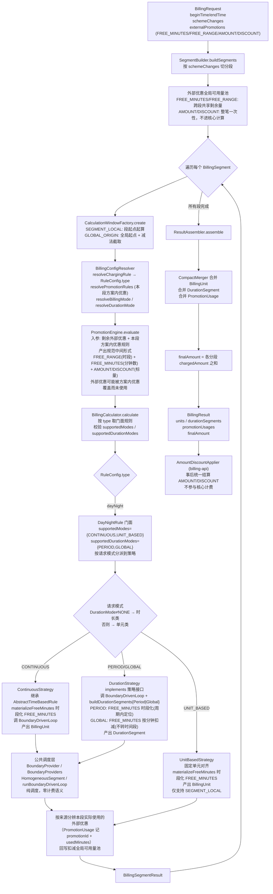

# 计费引擎计算流程

本文描述计费引擎**当前**的计算链路与语义。分段与优惠一致性的完整论证见 `docs/designs/segment-promotion-consistency.md`。

最后更新日期：2026-07-03

---

## 1. 总览

```
BillingRequest
  -> BillingService.calculate()
      -> SegmentBuilder.buildSegments()
      -> for each segment:
          -> CalculationWindowFactory.create()
          -> BillingConfigResolver.resolveChargingRule()
          -> BillingConfigResolver.resolvePromotionRules()
          -> BillingConfigResolver.resolveBillingMode()
          -> BillingConfigResolver.resolveDurationMode()
          -> PromotionEngine.evaluate()
          -> BillingCalculator.calculate()
      -> ResultAssembler.assemble()
```

主流程由 `BillingService` 编排。它不直接读取数据库，也不直接决定业务规则；规则和优惠配置由调用方实现的 `BillingConfigResolver` 提供。

### 计算流程图

每个计费规则族一个 `ChargeRuleType`、一个门面规则（如 `DayNightRule`）、一个共享 config。门面按模式分派到独立策略实现，模式分两个维度对称声明：`BillingMode`（CONTINUOUS/UNIT_BASED，单元计费类）和 `DurationMode`（PERIOD/GLOBAL，时长计费类）。



要点：

- **门面 + 策略，统一入口**：每个规则族一个 type（如 `dayNight`），一个门面规则（`DayNightRule`）+ 一个共享 config。门面按请求模式分派到独立策略实现，自身只分派不扛逻辑。流程图以 `dayNight` 为示例，其他规则族（`relativeTime`/`naturalTime`/`compositeTime`/`flatFree`）结构相同，各自门面按声明的模式分派。
- **二级分类**：单元计费类（CONTINUOUS/UNIT_BASED，产 `BillingUnit`）与时长计费类（PERIOD/GLOBAL，产 `DurationSegment`）产出结构、切分模型、封顶语义、优惠消费都不同，各自独立策略。
- **两个模式维度对称**：保留 `BillingMode` + `DurationMode` 两个枚举，`supportedModes()` 管 CONTINUOUS/UNIT_BASED，`supportedDurationModes()` 管 PERIOD/GLOBAL，对称声明。DurationMode≠NONE 走时长策略，否则按 BillingMode 走单元策略，天然互斥。
- **公共调度层共享**：CONTINUOUS 策略（经 `AbstractTimeBasedRule`）和时长策略都调用 `BoundaryDrivenLoop`，该层只含边界调度原语，零计费语义。UNIT_BASED 策略不走该层。
- **外部优惠全局一致**：分段前建立外部优惠可用量池，跨段共享剩余量；每段 evaluate 时剩余外部优惠与本段方案内优惠按优先级聚合，外部优惠可能被方案内优惠覆盖而未使用。按优惠来源从本段结果分辨实际使用量，回写扣减池，下段拿到正确的剩余外部优惠。
- **AMOUNT/DISCOUNT 不进核心计算**：只 FREE_MINUTES/FREE_RANGE 参与免费段切分与跨段扣减；AMOUNT/DISCOUNT 整笔一次性，由 `AmountDiscountApplier` 在最终结果上事后结算。
- **FREE_MINUTES 的表示形式按模式区分**：聚合产出规范中间形式（FREE_RANGE 为时段、FREE_MINUTES 为分钟数），不集中时段化。CONTINUOUS/UNIT_BASED/PERIOD 策略经 `materializeFreeMinutes` 自行时段化；GLOBAL 按分钟直接扣减 chargedMinutes，不时段化。

分段每段独立计算，不传规则/优惠/累计状态。

---

## 2. 输入：`BillingRequest`

| 字段 | 含义 |
|------|------|
| `id` | 请求标识 |
| `beginTime` / `endTime` | 计费起止时间 |
| `calcEndTime` | 可选计算终点，用于局部计算 |
| `schemeId` | 单方案计费 ID |
| `schemeChanges` | 多方案切换时间轴 |
| `segmentCalculationMode` | 分段起算方式 |
| `externalPromotions` | 外部传入的优惠 grant |
| `timeRoundingMode` | 时间取整模式 |
| `disableSimplification` | 是否禁用简化计算 |
| `context` | 传给配置解析器的调用方上下文 |

---

## 3. 分段：`SegmentBuilder`

单方案场景：

```
schemeId + beginTime/endTime -> one BillingSegment
```

多方案场景：

```
schemeChanges -> multiple BillingSegment
```

每个分段包含：

- `id`
- `beginTime`
- `endTime`
- `schemeId`

**期望语义**：分段每段独立计算，不传任何规则/优惠/累计状态，`ResultAssembler` 拼接结果。跨段规则类型/方案不同，周期封顶跨段无意义。

---

## 4. 计算窗口：`CalculationWindowFactory`

每个分段会生成一个 `CalculationWindow`：

| 字段 | 含义 |
|------|------|
| `calculationBegin` | 规则实际起算点 |
| `calculationEnd` | 规则实际计算终点 |
| `clipBegin` | 输出裁剪起点（GLOBAL_ORIGIN 减法用，未实现） |
| `clipEnd` | 输出裁剪终点（GLOBAL_ORIGIN 减法用，未实现） |

`SegmentCalculationMode` 决定 `calculationBegin`：

| 模式 | 行为 |
|------|------|
| `SINGLE` | 单段计算 |
| `SEGMENT_LOCAL` | 每个分段从自身开始时间起算 |
| `GLOBAL_ORIGIN` | 所有分段共享请求开始时间作为全局原点（减法未实现，当前仅支持单分段） |

**当前状态**：GLOBAL_ORIGIN 减法未实现，`BillingService` 加守卫——GLOBAL_ORIGIN + 多分段抛异常（仅单分段可用，等价 SEGMENT_LOCAL）；UNIT_BASED + GLOBAL_ORIGIN 抛异常。

---

## 5. 配置解析：`BillingConfigResolver`

每个分段会解析四类配置：

| 方法 | 返回 | 用途 |
|------|------|------|
| `resolveChargingRule()` | `RuleConfig` | 当前分段使用的计费规则 |
| `resolvePromotionRules()` | `List<PromotionRuleConfig>` | 当前分段使用的优惠规则 |
| `resolveBillingMode()` | `BillingMode` | 当前分段的计费模式 |
| `resolveDurationMode()` | `DurationMode` | 当前分段的时长计费模式 |

这是业务侧接入引擎的主要扩展点。

---

## 6. 优惠聚合：`PromotionEngine`

`PromotionEngine.evaluate(context)` 输出 `PromotionAggregate`。

处理顺序：

1. 执行优惠规则，收集规则 grant。
2. 加入请求中的外部 grant。
3. 合并显式 `FREE_RANGE`。
4. 汇总 AMOUNT / DISCOUNT 优惠。

产出规范中间形式：`freeTimeRanges`（仅 FREE_RANGE，已合并）、`freeMinutesList`（未时段化 FREE_MINUTES）、`freeMinutes`（标量，简化判定用）、`amountDiscounts`/`totalAmountDiscount`/`bestDiscountRate`。

时段化是策略侧职责：CONTINUOUS/UNIT_BASED/PERIOD 策略经 `materializeFreeMinutes` 时段化；GLOBAL 按分钟扣减 `chargedMinutes`，不时段化。

---

## 7. 规则执行：`BillingCalculator`

`BillingCalculator.calculate(context, promotionAggregate)` 做四件事：

1. 根据 `RuleConfig.type` 从 `BillingRuleRegistry` 获取门面规则实现。
2. 校验规则是否支持当前 `BillingMode`（`supportedModes()`）。
3. 校验规则是否支持当前 `DurationMode`（`supportedDurationModes()`，非 NONE 时）。
4. 校验配置类型后调用 `BillingRule.calculate()`，门面按请求模式分派到策略。

## 7. 规则执行：`BillingCalculator`

`BillingCalculator.calculate(context, promotionAggregate)` 做四件事：

1. 根据 `RuleConfig.type` 从 `BillingRuleRegistry` 获取门面规则实现。
2. 校验规则是否支持当前 `BillingMode`（`supportedModes()`）。
3. 校验规则是否支持当前 `DurationMode`（`supportedDurationModes()`，非 NONE 时）。
4. 校验配置类型后调用 `BillingRule.calculate()`，门面按请求模式分派到策略。

每个计费规则族一个 type、一个门面规则、一个共享 config。门面声明 `supportedModes()`（管 CONTINUOUS/UNIT_BASED）与 `supportedDurationModes()`（管 PERIOD/GLOBAL），按请求模式分派到独立策略实现。规则族包括 `dayNight`、`relativeTime`、`naturalTime`、`compositeTime` 和 `flatFree`，各规则族按需声明支持的模式。

**单元计费类**（产 `BillingUnit`）：
- CONTINUOUS 策略：时间计费规则族通过 `AbstractTimeBasedRule.runBoundaryDrivenLoop` 公共循环切割时间轴，每次迭代产出同质段（`HomogeneousSegment`），再由 `applyCapAndAccumulate` 转换为 `BillingUnit`（含封顶、累计金额、compact 合并、截断标记）。
- UNIT_BASED 策略：固定单元对齐 + 完整覆盖才免费，不走边界驱动公共循环。

**时长计费类**（产 `DurationSegment`）：复用边界驱动循环。PERIOD 策略周期内时长计费 + 周期封顶；GLOBAL 策略全局时长计费，时段封顶与周期封顶按周期数倍乘。

边界驱动循环（`runBoundaryDrivenLoop` + `BoundaryProviders` + `HomogeneousSegment`）是纯调度层，零计费语义，CONTINUOUS 策略和时长策略共享；UNIT_BASED 策略不走该层。

---

## 8. 计费单元：`BillingUnit`

`BillingUnit`（CONTINUOUS / UNIT_BASED 模式产出）的关键语义：

| 字段 | 含义 |
|------|------|
| `beginTime` / `endTime` | 单元起止时间 |
| `durationMinutes` | 单元分钟数 |
| `unitPrice` | 单元价格，由具体规则解释 |
| `originalAmount` | 优惠前金额 |
| `chargedAmount` | 单元完整结束后的最终金额 |
| `accumulatedAmount` | 段内累计金额（从分段起点累加，不跨段） |
| `free` / `freePromotionId` | 是否被优惠完全覆盖及对应优惠 ID |
| `ruleData` | 规则私有数据，例如周期序号或简化单元标记 |
| `isTruncated` | 是否被 `calcEndTime` 截断（不足单元计费触发条件） |
| `compact` | 是否为 compact 单元（合并了 N 个连续相同子单元） |
| `count` | compact 单元代表的子单元数量，非 compact 始终为 1 |

---

## 9. 时长计费段：`DurationSegment`

`DurationSegment`（DurationMode 产出）将时间轴视为连续分钟流，按时段类型分组：

| 字段 | 含义 |
|------|------|
| `beginTime` / `endTime` | 段起止时间 |
| `periodLabel` | period 性质（"day"/"night"/"period-1"，规则自定义） |
| `chargedMinutes` | 收费分钟数（免费段=0） |
| `unitPrice` | 单价 |
| `chargedAmount` | 应收（时段封顶后，周期封顶前） |
| `periodCap` | 该时段封顶金额（null=无封顶） |
| `freePromotionId` | 免费段对应的 FreeTimeRange.id（非免费段 null），用于聚合 PromotionUsage |
| `originalAmount` | 按规则原价（封顶前；免费段非 0，用于等效优惠金额） |

封顶落盘策略：时段封顶落盘到 `chargedAmount`；周期封顶不落盘，只影响 `BillingSegmentResult.chargedAmount`。免费段用 `chargedMinutes=0` 表达，免费原因走 `PromotionUsage` 汇总（`freePromotionId` 关联 FREE_RANGE，`originalAmount` 聚合等效优惠金额）。

---

## 10. 简化计算

`AbstractTimeBasedRule` 提供长周期简化能力。

简化单元通过 `ruleData` 标记：

```json
{
  "isSimplified": true,
  "cycleIndex": 1,
  "simplifiedCycleCount": 10,
  "simplifiedCycleAmount": 120.00
}
```

简化单元不承诺保存完整单元内部细节。精确查询由调用方设置 `disableSimplification=true` 触发重算。

---

## 11. 汇总：`ResultAssembler`

`ResultAssembler.assemble()` 合并所有分段结果：

- 通过 `CompactMerger.merge` 合并 `BillingUnit`，跨分段的连续相同单元合并为 compact 单元（跨分段边界不合并）。
- 合并 `DurationSegment`（时长模式）。
- 合并 `PromotionUsage`。
- 计算最终金额：统一为各分段 `chargedAmount` 之和。
- 计算 `effectiveFrom`、`effectiveTo` 和 `calculationEndTime`。

输出为 `BillingResult`。

---

## 12. 优惠等效金额

优惠等效金额由 `billing-api` 中的 `PromotionEquivalentCalculator` 计算。

它基于完整结算结果做对比分析：通过 `PromotionAggregateUtil.exclude` 过滤 `freeMinutesList`/`freeTimeRanges`，重算取差值。只要完整结果中的 `chargedAmount` 和 `promotionUsages` 一致，等效金额语义不变。

---

## 13. 相关文档

| 文档 | 用途 |
|------|------|
| `docs/billing-engine-capabilities-zh.md` | 当前能力中文说明 |
| `docs/billing-engine-capabilities.md` | 当前能力英文说明 |
| `docs/USER_GUIDE.md` | 调用方使用指南 |
| `docs/designs/segment-promotion-consistency.md` | 分段与优惠一致性架构讨论 |
| `docs/billing-engine-calculation-flow-zh-legacy.md` | 旧版计算流程（历史现状，已过时，仅供对照） |
| `docs/TODO.md` | 待办和问题索引 |
| `docs/DONE.md` | 已完成事项索引 |
