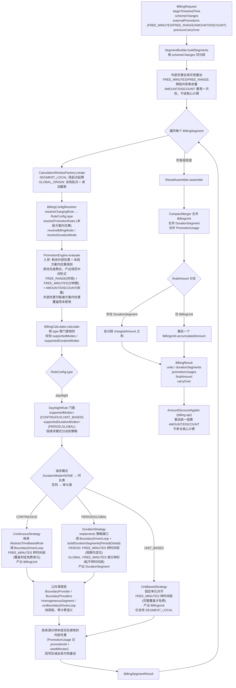

# 计费引擎期望计算流程

本文描述计费引擎**期望达到**的计算链路与语义，作为功能开发规划的指导。代码当前现状与期望的差距见 `docs/TODO.md` 及各 TODO 详情；分段与优惠一致性的完整论证见 `docs/designs/segment-promotion-consistency.md`。旧版（描述历史现状，已过时）保留在 `docs/billing-engine-calculation-flow-zh-legacy.md` 供参考。

最后更新日期：2026-07-02

---

## 1. 总览

```
BillingRequest
  -> BillingService.calculate()
      -> SegmentBuilder.buildSegments()
      -> for each segment:
          -> CalculationWindowFactory.create()
          -> BillingConfigResolver.resolveChargingRule()
          -> BillingConfigResolver.resolvePromotionRules()
          -> BillingConfigResolver.resolveBillingMode()
          -> BillingConfigResolver.resolveDurationMode()
          -> PromotionEngine.evaluate()
          -> BillingCalculator.calculate()
      -> ResultAssembler.assemble()
```

主流程由 `BillingService` 编排。它不直接读取数据库，也不直接决定业务规则；规则和优惠配置由调用方实现的 `BillingConfigResolver` 提供。

期望链路与现状一致，差异在各步骤的语义（分段模式、优惠处理、状态传递），见后续章节。

### 计算流程图

每个计费规则族一个 `ChargeRuleType`、一个门面规则（如 `DayNightRule`）、一个共享 config。门面按模式分派到独立策略实现，模式分两个维度对称声明：`BillingMode`（CONTINUOUS/UNIT_BASED，单元计费类）和 `DurationMode`（PERIOD/GLOBAL，时长计费类）。



要点：

- **门面 + 策略，统一入口**：每个规则族一个 type（如 `dayNight`），一个门面规则（`DayNightRule`）+ 一个共享 config。门面按请求模式分派到独立策略实现，自身只分派不扛逻辑。修复 UNIT_BASED 与 CONTINUOUS 无法共存的注册缺口——一个 type 一个实现支持多模式，不需覆盖注册。流程图以 `dayNight` 为示例，其他规则族（`relativeTime`/`naturalTime`/`compositeTime`/`flatFree`）结构相同，各自门面按声明的模式分派。
- **二级分类**：单元计费类（CONTINUOUS/UNIT_BASED，产 `BillingUnit`）与时长计费类（PERIOD/GLOBAL，产 `DurationSegment`）产出结构、切分模型、封顶语义、优惠消费都不同，各自独立策略。CONTINUOUS/UNIT_BASED 切分模型根本不同，各自独立策略类；PERIOD/GLOBAL 同切分模型仅封顶数学不同，方法级分离。
- **两个模式维度对称**：保留 `BillingMode` + `DurationMode` 两个枚举，`supportedModes()` 管 CONTINUOUS/UNIT_BASED，`supportedDurationModes()` 管 PERIOD/GLOBAL，对称声明。DurationMode≠NONE 走时长策略，否则按 BillingMode 走单元策略，天然互斥。
- **所有模式一视同仁**：没有模式是"基础/必须"的，规则至少支持一种，不强制特定模式。其他规则族按需声明。
- **公共调度层共享**：单元策略（CONTINUOUS 经 `AbstractTimeBasedRule`）和时长策略都调用 `BoundaryDrivenLoop`，该层只含边界调度原语，零计费语义。UNIT_BASED 策略不走该层。
- **CONTINUE 仅单元计费类有意义**：`previousCarryOver` 续算路径只服务 CONTINUOUS/UNIT_BASED；时长计费类不参与 CONTINUE，摆脱 carryOver 机制影响。
- **外部优惠全局一致**：分段前建立外部优惠可用量池，跨段共享剩余量；每段 evaluate 时剩余外部优惠与本段方案内优惠按优先级聚合，外部优惠可能被方案内优惠覆盖而未使用。按优惠来源（方案内跟方案走、外部跟请求走）从本段结果分辨实际使用量，回写扣减池，下段拿到正确的剩余外部优惠。
- **AMOUNT/DISCOUNT 不进核心计算**：只 FREE_MINUTES/FREE_RANGE 参与免费段切分与跨段扣减；AMOUNT/DISCOUNT 整笔一次性，由 `AmountDiscountApplier` 在最终结果上事后结算。
- **FREE_MINUTES 的表示形式按模式区分**：聚合产出规范中间形式（FREE_RANGE 为时段、FREE_MINUTES 为分钟数），不集中时段化（"时段化"指把 FREE_MINUTES 分钟数转为具体时间段，见 spec 术语定义）。CONTINUOUS/UNIT_BASED/PERIOD 需时段化为时间段（覆盖判定或周期内定位需要时间位置）；GLOBAL 全局累加，按分钟直接扣减 chargedMinutes，不时段化。时段化是消费者侧职责，不是聚合的固有职责。

分段每段独立计算，不传规则/优惠/累计状态；CONTINUE 通过 `previousCarryOver` 进入续算路径，与分段机制正交。

---

## 2. 输入：`BillingRequest`

| 字段 | 含义 |
|------|------|
| `id` | 请求标识 |
| `beginTime` / `endTime` | 计费起止时间 |
| `calcEndTime` | 可选计算终点，用于局部计算和 CONTINUE 场景 |
| `schemeId` | 单方案计费 ID |
| `schemeChanges` | 多方案切换时间轴 |
| `segmentCalculationMode` | 分段起算方式 |
| `externalPromotions` | 外部传入的优惠 grant |
| `previousCarryOver` | 上次计算的结转状态 |
| `timeRoundingMode` | 时间取整模式 |
| `disableSimplification` | 是否禁用简化计算 |
| `context` | 传给配置解析器的调用方上下文 |

---

## 3. CONTINUE 处理

当 `request.previousCarryOver != null` 时进入继续计算路径。CONTINUE 是**按需特性**，不强制每个规则支持。

核心语义：

- 如果存在 `lastTruncatedUnitStartTime`，本次从该截断单元的开始时间重新计算。
- 如果不存在截断单元，则从 `calculatedUpTo` 继续。
- `accumulatedAmount` 会作为累计金额基数继续使用。
- 分段级 `ruleState` 和 `promotionState` 会传回规则和优惠引擎。

这样可以避免"上次截断单元"和"本次新单元"之间重复收费。

**期望边界**：

- CONTINUE 专用 `carryOver`，与分段（schemeChanges）机制正交分离。分段不再借用 carryOver 传递状态。
- DurationMode 不支持 CONTINUE。
- `previousAccumulatedAmount` 的跨段传递限定为 CONTINUE 场景，纯分段不传。

---

## 4. 分段：`SegmentBuilder`

单方案场景：

```
schemeId + beginTime/endTime -> one BillingSegment
```

多方案场景：

```
schemeChanges -> multiple BillingSegment
```

每个分段包含：

- `id`
- `beginTime`
- `endTime`
- `schemeId`

**期望语义**：分段每段独立计算，不传任何规则/优惠/累计状态，`ResultAssembler` 拼接结果。跨段规则类型/方案不同，周期封顶跨段无意义。

---

## 5. 计算窗口：`CalculationWindowFactory`

每个分段会生成一个 `CalculationWindow`：

| 字段 | 含义 |
|------|------|
| `calculationBegin` | 规则实际起算点 |
| `calculationEnd` | 规则实际计算终点 |
| `clipBegin` | 输出裁剪起点（GLOBAL_ORIGIN 减法用） |
| `clipEnd` | 输出裁剪终点（GLOBAL_ORIGIN 减法用） |

`SegmentCalculationMode` 决定 `calculationBegin`：

| 模式 | 行为 |
|------|------|
| `SINGLE` | 单段计算 |
| `SEGMENT_LOCAL` | 每个分段从自身开始时间起算 |
| `GLOBAL_ORIGIN` | 所有分段共享请求开始时间作为全局原点，按减法实现截取（减法未实现，当前止血，见下） |

在 CONTINUE 模式下，窗口起点不能早于恢复后的实际起点。

**期望语义**（减法未实现，当前为半成品）：

- `SEGMENT_LOCAL`：每段独立起算，`clipBegin/clipEnd` 不参与。
- `GLOBAL_ORIGIN`：期望通过减法实现，`分段i = calc(全局起点→段末) − calc(全局起点→段首)`，`clipBegin/clipEnd` 接线为截取边界，两次计算共享同一全局起点。**减法未实现**（`clipBegin/clipEnd` 从未被读取），多分段下会双重计费。
- `UNIT_BASED` 与 `GLOBAL_ORIGIN` 结构性不兼容（单元对齐语义与全局截取冲突），UNIT_BASED 仅支持 `SEGMENT_LOCAL`。

**当前止血**（TODO-20260702-001）：GLOBAL_ORIGIN 减法未实现，`BillingService` 加守卫——GLOBAL_ORIGIN + 多分段抛异常（仅单分段可用，等价 SEGMENT_LOCAL）；UNIT_BASED + GLOBAL_ORIGIN 抛异常。减法完整实现待后续 TODO。

---

## 6. 配置解析：`BillingConfigResolver`

每个分段会解析四类配置：

| 方法 | 返回 | 用途 |
|------|------|------|
| `resolveChargingRule()` | `RuleConfig` | 当前分段使用的计费规则 |
| `resolvePromotionRules()` | `List<PromotionRuleConfig>` | 当前分段使用的优惠规则 |
| `resolveBillingMode()` | `BillingMode` | 当前分段的计费模式 |
| `resolveDurationMode()` | `DurationMode` | 当前分段的时长计费模式 |

这是业务侧接入引擎的主要扩展点。

---

## 7. 优惠聚合：`PromotionEngine`

`PromotionEngine.evaluate(context)` 输出 `PromotionAggregate`。

处理顺序：

1. 执行优惠规则，收集规则 grant。
2. 加入请求中的外部 grant。
3. 恢复 CONTINUE 优惠结转。
4. 合并显式 `FREE_RANGE`。
5. 将 `FREE_MINUTES` 分配到可用空隙。
6. 合并最终免费时段。
7. 汇总 AMOUNT / DISCOUNT 优惠。
8. 生成新的 PromotionCarryOver。

输出中的 `freeTimeRanges` 会交给计费规则决定如何影响计费单元；`AMOUNT` / `DISCOUNT` 不参与免费时段切分，而是在计费结果生成后统一结算。

**期望语义**：

- **优惠是全局概念，不是分段概念**。用户视角是"整笔停车享了什么优惠"，分段是引擎内部实现细节，不应导致优惠重复或丢失。
- **方案内优惠**（`promotionRules` 来源，跟方案走）：每段独立合理，分段1 用方案A 的优惠、分段2 用方案B 的优惠。
- **外部优惠**（`externalPromotions` 来源，跟请求走）：全局一致，整笔停车享一次。
- 期望在 `PromotionEngine` 或 `BillingService` 层区分两类优惠的处理：方案内优惠每段独立 evaluate；外部优惠全局一致（依赖 GLOBAL_ORIGIN 减法，或独立的全局预分配机制）。
- `FREE_RANGE` 在所有计费模式下产出 `PromotionUsage`，记录覆盖范围、扣除分钟数、等效优惠金额。
- `FreeMinuteAllocator` 分配位置只依赖窗口起点 + FREE_RANGE + 窗口长度，与计费规则无关。这是 GLOBAL_ORIGIN 减法能跨方案工作的技术基础：同窗口起点 → 同一分配位置 → 减法抵消前段优惠使用，不需跨段传优惠状态。

---

## 8. 规则执行：`BillingCalculator`

`BillingCalculator.calculate(context, promotionAggregate)` 做四件事：

1. 根据 `RuleConfig.type` 从 `BillingRuleRegistry` 获取门面规则实现。
2. 校验规则是否支持当前 `BillingMode`（`supportedModes()`）。
3. 校验规则是否支持当前 `DurationMode`（`supportedDurationModes()`，非 NONE 时）。
4. 校验配置类型后调用 `BillingRule.calculate()`，门面按请求模式分派到策略。

每个计费规则族一个 type、一个门面规则、一个共享 config。门面声明 `supportedModes()`（管 CONTINUOUS/UNIT_BASED）与 `supportedDurationModes()`（管 PERIOD/GLOBAL），按请求模式分派到独立策略实现。期望的主要规则族包括 `dayNight`、`relativeTime`、`naturalTime`、`compositeTime` 和 `flatFree`，各规则族按需声明支持的模式，至少一种。

**单元计费类**（产 `BillingUnit`）：
- CONTINUOUS 策略：时间计费规则族（`dayNight`/`relativeTime`/`naturalTime`/`compositeTime`）通过 `AbstractTimeBasedRule.runBoundaryDrivenLoop` 公共循环切割时间轴——每次迭代从当前位置查询所有边界来源中最近的边界，跳到那里产出一个同质段（`HomogeneousSegment`），再由 `applyCapAndAccumulate` 转换为 `BillingUnit`（含封顶、累计金额、compact 合并、截断标记）。边界来源由策略通过 `BoundaryProvider` 注册（免费时段起止、时段结束、周期结束、单元对齐、calcEnd 等）。compact 单元是该循环的自然产物，无需后处理合并。
- UNIT_BASED 策略：固定单元对齐 + 完整覆盖才免费，不走边界驱动公共循环。与 CONTINUOUS 切分模型根本不同，独立策略类。

**时长计费类**（产 `DurationSegment`）：复用边界驱动循环，仅在产出阶段区分。PERIOD 策略周期内时长计费 + 周期封顶；GLOBAL 策略全局时长计费，时段封顶与周期封顶按周期数倍乘。两者同切分模型仅封顶数学不同，方法级分离，放同一时长策略类内两个 build 函数。

边界驱动循环（`runBoundaryDrivenLoop` + `BoundaryProviders` + `HomogeneousSegment`）是纯调度层，零计费语义，CONTINUOUS 策略和时长策略共享；UNIT_BASED 策略不走该层。

---

## 9. 计费单元：`BillingUnit`

`BillingUnit`（CONTINUOUS / UNIT_BASED 模式产出）的关键语义：

| 字段 | 含义 |
|------|------|
| `beginTime` / `endTime` | 单元起止时间 |
| `durationMinutes` | 单元分钟数 |
| `unitPrice` | 单元价格，由具体规则解释 |
| `originalAmount` | 优惠前金额 |
| `chargedAmount` | 单元完整结束后的最终金额 |
| `accumulatedAmount` | 单元完整结束后的累计金额 |
| `free` / `freePromotionId` | 是否由非条件免费完全覆盖及对应优惠 ID |
| `valueSpec` | 单元内查询时点投影模型 |
| `ruleData` | 规则私有数据，例如周期序号或简化单元标记 |
| `isTruncated` | 是否被 `calcEndTime` 截断 |
| `compact` | 是否为 compact 单元（合并了 N 个连续相同子单元） |
| `count` | compact 单元代表的子单元数量，非 compact 始终为 1 |

`conditionalFree` 和 `conditionalFreeUntil` 已不再是主模型字段。条件起始免费通过 `StepValueSpec` 表达。

---

## 10. 时长计费段：`DurationSegment`

`DurationSegment`（DurationMode 产出）将时间轴视为连续分钟流，按时段类型分组：

| 字段 | 含义 |
|------|------|
| `beginTime` / `endTime` | 段起止时间 |
| `periodLabel` | period 性质（"day"/"night"/"period-1"，规则自定义） |
| `chargedMinutes` | 收费分钟数（免费段=0） |
| `unitPrice` | 单价 |
| `chargedAmount` | 应收（时段封顶后，周期封顶前） |
| `periodCap` | 该时段封顶金额（null=无封顶） |

封顶落盘策略：时段封顶落盘到 `chargedAmount`；周期封顶不落盘，只影响 `BillingSegmentResult.chargedAmount`。免费段用 `chargedMinutes=0` 表达，免费原因走 `PromotionUsage` 汇总。

---

## 11. 单元求值：`valueSpec`

`valueSpec` 的职责是回答：

```
如果计费在 queryTime 这一刻结束，命中单元当前应收多少？
```

公共协议：

- `UnitValueSpec.project(queryTime, unitBeginTime, unitEndTime)`
- `UnitValueProjection(currentAmount, nextChangeTime)`
- `UnitValueEvaluator.evaluate(...)`

已实现通用表达：

- `FixedValueSpec`
- `StepValueSpec`
- `PiecewiseTimeValueSpec`

`DayNightRule` 还包含规则私有表达：

- `MixedUnitValueSpec`
- `CappedValueSpec`

通用查询层不解析规则私有 `ruleData`，只走 `valueSpec`。

---

## 12. 查询摘要：`BillingResultViewer.createQuerySummary`

查询摘要只基于已经计算出的 `BillingResult`。

处理规则：

1. 如果 `queryTime > calculationEndTime`，直接报错。
2. 找到包含 `queryTime` 的命中单元。
3. 对命中单元执行 `UnitValueEvaluator`。
4. 使用以下公式计算查询金额：

```
queryAmount = unit.accumulatedAmount - unit.chargedAmount + valueAt(unit, queryTime)
```

5. `effectiveTo` 使用 `UnitValueProjection.nextChangeTime`，而不是简单使用单元结束时间。

如果旧结果没有 `valueSpec`，查询层会退化为 `FixedValueSpec(chargedAmount)`。

---

## 13. `BillingTemplate.calculateWithQuery`

`calculateWithQuery(request, queryTime)` 是推荐的查询入口。

流程：

1. 先执行一次正常计费。
2. 生成 `QuerySummary`。
3. 如果命中单元是简化单元，复制请求并设置 `disableSimplification=true`。
4. 重新计算一次精确结果。
5. 基于精确结果重新生成 `QuerySummary`。

这使长期计费可以继续使用简化计算，同时保证查询命中简化单元时仍返回精确结果。

---

## 14. 简化计算

`AbstractTimeBasedRule` 提供长周期简化能力。

简化单元通过 `ruleData` 标记：

```json
{
  "isSimplified": true,
  "cycleIndex": 1,
  "simplifiedCycleCount": 10,
  "simplifiedCycleAmount": 120.00
}
```

简化单元不承诺保存完整单元内部细节。精确查询由 `billing-api` 层触发禁用简化的重算。

---

## 15. 汇总：`ResultAssembler`

`ResultAssembler.assemble()` 合并所有分段结果：

- 通过 `CompactMerger.merge` 合并 `BillingUnit`，跨分段的连续相同单元合并为 compact 单元（跨分段边界不合并）。
- 合并 `DurationSegment`（时长模式）。
- 合并 `PromotionUsage`。
- 计算最终金额：时长模式（任一分段 `durationMode != NONE`）= 各分段 `chargedAmount` 之和；单元模式 = 最后一个 `BillingUnit.accumulatedAmount`。
- 计算 `effectiveFrom`、`effectiveTo` 和 `calculationEndTime`。
- 生成新的 `BillingCarryOver`（CONTINUE 用，分段不依赖）。

输出为 `BillingResult`。

---

## 16. 优惠等效金额

优惠等效金额由 `billing-api` 中的 `PromotionEquivalentCalculator` 计算。

它基于完整结算结果做对比分析，不依赖查询时点投影；金额减免和折扣优惠的最终应用由 `AmountDiscountApplier` 完成。只要完整结果中的 `chargedAmount`、`accumulatedAmount` 和 `promotionUsages` 一致，`valueSpec` 不会改变优惠等效金额语义。

---

## 17. 相关文档

| 文档 | 用途 |
|------|------|
| `docs/billing-engine-capabilities-zh.md` | 当前能力中文说明 |
| `docs/billing-engine-capabilities.md` | 当前能力英文说明 |
| `docs/USER_GUIDE.md` | 调用方使用指南 |
| `docs/designs/segment-promotion-consistency.md` | 分段与优惠一致性架构讨论（期望状态论证） |
| `docs/billing-engine-calculation-flow-zh-legacy.md` | 旧版计算流程（历史现状，已过时，仅供对照） |
| `docs/TODO.md` | 待办和问题索引（现状→期望差距） |
| `docs/superpowers/specs/2026-04-20-unit-value-spec-design.md` | `valueSpec` 设计 |
