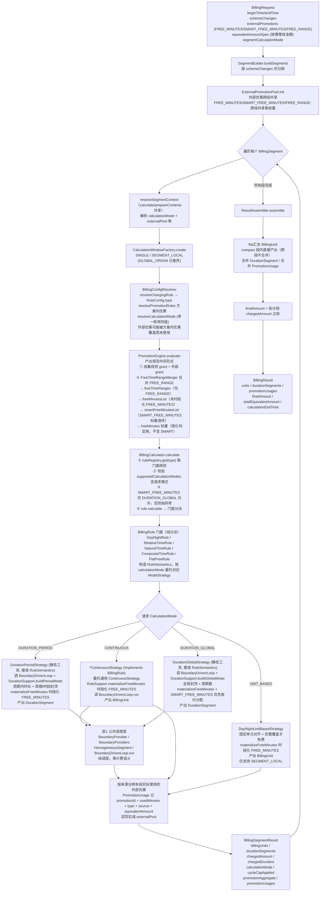

# 计费引擎当前代码执行流程

本文描述计费引擎**当前代码**的实际执行链路。规则抽象重构（TODO-20260706-002）与输出优化（TODO-20260706-003）已落地，当前代码即目标架构；与设计文档（[`billing-engine-calculation-flow-zh.md`](billing-engine-calculation-flow-zh.md)）基本一致，差异见文末"与设计对照"。

最后更新日期：2026-07-06（反映 TODO-20260706-002 四层架构 + 003 输出优化后的状态）

---

## 1. 执行流程图

---

## 2. 关键节点说明

### 2.1 BillingService.calculate（编排层）

- **四层架构编排**：`RuleSemantics`（层 0，描述"是什么"）→ `BoundaryDrivenLoop`（层 1，纯调度）→ `ModeStrategy`（层 2，描述"怎么算"）→ `BillingRule` 门面（层 3，纯分派）。`BillingService` 编排分段与外部优惠池，不直接读数据库也不决定业务规则。
- **resolveSegmentContext 共享**：`calculate` 与 `prepareContexts` 共用 `resolveSegmentContext`（解析 `calculationMode` 与 `externalPool` 等），保证 `PromotionEquivalentCalculator` 等效金额与 `calculate` 解析一致。
- **GLOBAL_ORIGIN 已废弃**（TODO-20260706-003）：externalPool 跨段共享替代其外部优惠一致性目标；`SegmentCalculationMode` 仅保留 `SINGLE` / `SEGMENT_LOCAL`。
- **外部优惠跨段共享池**（`ExternalPromotionPool`）：段前 `remaining()` 取剩余量，段后 `writeBack(usages)` 扣减。
- **无跨段状态传递**：CONTINUE 模式已移除，`previousCarryOver`/`previousAccumulatedAmount`/`ruleState`/`promotionCarryOver` 均不存在。分段每段独立计算，`ResultAssembler` 拼接结果。

### 2.2 PromotionEngine.evaluate（聚合层，中间形式）

产出规范中间形式，**不再集中时段化 FREE_MINUTES**：

| 字段 | 内容 |
|------|------|
| `freeTimeRanges` | 仅 FREE_RANGE（已 `FreeTimeRangeMerger` 合并） |
| `freeMinutesList` | 未时段化的 FREE_MINUTES 列表 |
| `smartFreeMinutesList` | SMART_FREE_MINUTES 标量透传（不时段化、不计入简化判定） |
| `freeMinutes` | 标量 = `freeMinutesList` 求和（简化计算判定用，不含 SMART） |

`PromotionUsage`（FREE_MINUTES/FREE_RANGE/SMART_FREE_MINUTES）由策略侧产出，按来源从本段结果分辨实际使用量后回写 externalPool。

### 2.3 BillingCalculator + 门面分派

- `BillingCalculator.calculate` 校验 `supportedCalculationModes`（单一 `CalculationMode` 枚举），不静默降级。
- `SMART_FREE_MINUTES` 守卫：非 `DURATION_GLOBAL` 模式遇 `SMART_FREE_MINUTES` 直接抛 `IllegalStateException`，复杂度锁定在 GLOBAL 内。
- 门面规则（`DayNightRule` 等）构造 `RuleSemantics`，按请求 `CalculationMode` 分派到对应 `ModeStrategy`，自身只分派不扛逻辑。

门面与模式支持矩阵：

| 门面规则 | supportedCalculationModes |
|----------|---------------------------|
| `DayNightRule` | CONTINUOUS, UNIT_BASED, DURATION_PERIOD, DURATION_GLOBAL |
| `RelativeTimeRule` | CONTINUOUS, DURATION_PERIOD, DURATION_GLOBAL |
| `NaturalTimeRule` | CONTINUOUS, DURATION_PERIOD, DURATION_GLOBAL |
| `CompositeTimeRule` | CONTINUOUS, DURATION_PERIOD, DURATION_GLOBAL |
| `FlatFreeRule` | CONTINUOUS, UNIT_BASED |

### 2.4 策略侧 FREE_MINUTES 处理

| 策略 | FREE_MINUTES 处理 | 产出 |
|------|-------------------|------|
| `*ContinuousStrategy`（经 `RuleSupport.materializeFreeMinutes`） | 前置时段化（窗口起点附近分配）→ `finalFreeRanges` | BillingUnit + FREE_RANGE/FREE_MINUTES usage |
| `DayNightUnitBasedStrategy`（经 `RuleSupport.materializeFreeMinutes`） | 前置时段化 → `finalFreeRanges`（完整覆盖才免费） | BillingUnit + usage |
| `DurationPeriodStrategy`（接收 `RuleSemantics`） | 前置时段化（周期内定位） | DurationSegment + usage |
| `DurationGlobalStrategy`（接收 `RuleSemantics`） | 前置时段化 FREE_MINUTES + 消费 `SMART_FREE_MINUTES`（按 `RuleSemantics.priceAt` 切同价时段，按单价降序优先高价分配） | DurationSegment + usage |

`materializeFreeMinutes` 已从旧 `AbstractTimeBasedRule` 迁移到 `RuleSupport`（静态工具），各策略共用。`AbstractTimeBasedRule` 已删除，各 `*ContinuousStrategy` `implements BillingRule`。

### 2.5 ResultAssembler.assemble（汇总层）

- flat 汇总各分段 BillingUnit（compact 由 CONTINUOUS 策略段内直接产出，跨分段不合并，保留分段边界更直观）。
- 合并 `DurationSegment`（时长模式）与 `PromotionUsage`。
- **finalAmount = 各分段 `chargedAmount` 之和**（不再有 CONTINUE 三分支；CONTINUE 已移除）。
- 计算 `calculationEndTime`。

---

## 3. 与设计对照

对照 [`billing-engine-calculation-flow-zh.md`](billing-engine-calculation-flow-zh.md)（期望状态）。规则抽象重构（TODO-20260706-002）与输出优化（TODO-20260706-003）已落地，当前代码即目标架构。

### 3.1 已落地（与设计一致）

| 设计项 | 当前代码位置 |
|--------|--------------|
| 四层架构（RuleSemantics / BoundaryDrivenLoop / ModeStrategy / BillingRule 门面） | `RuleSemantics` + `BoundaryDrivenLoop` + 4 策略 + 门面规则 |
| 单一 `CalculationMode` 枚举（合并 BillingMode + DurationMode） | `BConstants.CalculationMode`（CONTINUOUS/UNIT_BASED/DURATION_PERIOD/DURATION_GLOBAL） |
| 4 规则族 × 4 模式（N+M 而非 N×M） | 各门面 `supportedCalculationModes` + 通用时长策略接收各 `*Semantics` |
| 门面纯分派，`*ContinuousStrategy` `implements BillingRule` | `DayNightContinuousStrategy` 等 4 个 |
| `materializeFreeMinutes` 迁移到 `RuleSupport` | `RuleSupport.materializeFreeMinutes`（`FreeMinuteAllocator`） |
| PromotionEngine 产出中间形式（不时段化） | `PromotionEngine.evaluate` 产出 `freeMinutesList`/`smartFreeMinutesList` |
| 时段化下放到策略侧 | `RuleSupport.materializeFreeMinutes`（CONTINUOUS/UNIT_BASED/DURATION_PERIOD/DURATION_GLOBAL 均前置时段化） |
| GLOBAL 前置时段化 FREE_MINUTES | `DurationGlobalStrategy` 经 `materializeFreeMinutes` |
| externalPool 跨段共享 | `ExternalPromotionPool` |
| resolveSegmentContext 共享（calculate/prepareContexts） | `BillingService.resolveSegmentContext` |
| SMART_FREE_MINUTES 仅 GLOBAL，优先高价分配 | `DurationGlobalStrategy` + `BillingCalculator` 守卫 |
| EquivalentAmountSpec 按需等效金额 | `PromotionEquivalentCalculator` + `BillingResult.totalEquivalentAmount` |
| PromotionUsage.source 透传 | `FreeTimeRange.source` / `FreeMinutes.source` → `PromotionUsage.source` |
| 公共调度层 BoundaryDrivenLoop | CONTINUOUS + 时长策略共享，UNIT_BASED 不走 |
| finalAmount = 各段 chargedAmount 之和 | `ResultAssembler.assemble` |

### 3.2 与设计的差距（当前代码未达到设计目标）

| 差距 | 现状 | 设计目标 |
|------|------|----------|
| GLOBAL_ORIGIN 已废弃 | externalPool 跨段共享替代（TODO-20260706-003 删枚举值） | `分段i = calc(全局起点→段末) − calc(全局起点→段首)`（4A 设计参考 segment-promotion-consistency.md） |

---

## 4. 已移除/废弃（历史对照）

下列概念已从当前代码移除，仅历史文档可见：

- **CONTINUE 模式与结转状态**：`carryOver` / `previousCarryOver` / `previousAccumulatedAmount` / `ruleState` / `promotionCarryOver` / CONTINUE 起点恢复 / finalAmount CONTINUE 三分支均已删除。分段每段独立，无跨段状态传递。
- **双 enum 分派**：`BillingMode` / `DurationMode` / `resolveBillingMode` / `resolveDurationMode` / `supportedModes` / `supportedDurationModes` 已合并为单一 `CalculationMode` / `resolveCalculationMode` / `supportedCalculationModes`。
- **`AbstractTimeBasedRule` / `SimplifiedUnitMeta` / 旧切段模型**：`splitTimeAxis` / `organizeByCycle` / `findCyclesWithPromotion` / `TimeFragment` / `CycleFragments` 已删除；`*ContinuousStrategy` 直接 `implements BillingRule`。
- **`DayNightDurationStrategy`**：已拆为通用 `DurationPeriodStrategy` / `DurationGlobalStrategy`（接收 `RuleSemantics`，所有规则族共用）。
- **GLOBAL 不时段化 `deductFreeMinutesGlobal`**：GLOBAL 已改为前置时段化 FREE_MINUTES（与其它模式一致），SMART_FREE_MINUTES 单独按高价分配。
- **`BillingResult.settlementAdjustments` / `effectiveFrom`·`To` / `BillingResult.of` / `SettlementEngine` / `ChargingResult`**：已删除。
- **`RelativeTimeContinuousCalculator` 等中间层**：阶段 2 删除，门面化后各规则族用 `*ContinuousStrategy`。

---

## 5. 相关文档

| 文档 | 用途 |
|------|------|
| [`billing-engine-calculation-flow-zh.md`](billing-engine-calculation-flow-zh.md) | 期望计算流程（与当前基本一致） |
| [`billing-engine-capabilities-zh.md`](billing-engine-capabilities-zh.md) | 当前能力说明 |
| [`billing-engine-capabilities.md`](billing-engine-capabilities.md) | 当前能力英文说明 |
| [`superpowers/specs/2026-07-06-rule-abstraction-refactor-design.md`](superpowers/specs/2026-07-06-rule-abstraction-refactor-design.md) | 规则抽象重构设计（四层架构，已实现） |
| [`superpowers/specs/2026-07-02-duration-rule-and-promotion-two-tier-design.md`](superpowers/specs/2026-07-02-duration-rule-and-promotion-two-tier-design.md) | 前置架构设计：时长规则与优惠两级模型 |
| [`TODO.md`](TODO.md) / [`DONE.md`](DONE.md) | 待办与完成索引 |
