# 计费引擎当前代码执行流程

本文描述计费引擎**当前代码**的实际执行链路，作为与设计文档（[`billing-engine-calculation-flow-zh.md`](billing-engine-calculation-flow-zh.md)，描述期望状态）对照的参考。两者差异见文末"与设计对照"。

最后更新日期：2026-07-03（反映 TODO-20260702-004 FREE_MINUTES 时段化下放后的状态）

---

## 1. 执行流程图

```mermaid
flowchart TD
    Req["BillingRequest<br/>beginTime/endTime<br/>schemeChanges<br/>externalPromotions<br/>previousCarryOver<br/>segmentCalculationMode"]

    Req --> Continue{"previousCarryOver != null?<br/>CONTINUE 模式"}
    Continue -->|是| CalcActual["计算 actualBeginTime<br/>优先 lastTruncatedUnitStartTime<br/>否则 calculatedUpTo<br/>恢复 previousAccumulatedAmount<br/>截断单元扣减金额"]
    Continue -->|否| UseBegin["actualBeginTime = beginTime"]
    CalcActual --> Seg
    UseBegin --> Seg

    Seg["SegmentBuilder.buildSegments<br/>按 schemeChanges 切分段"]
    Seg --> Guard["GLOBAL_ORIGIN 半成品守卫 TODO-20260702-001<br/>多分段抛异常 / UNIT_BASED+GLOBAL_ORIGIN 抛异常"]
    Guard --> Pool["ExternalPromotionPool.init<br/>外部优惠跨段共享 TODO-20260702-003<br/>FREE_MINUTES 按分钟 / FREE_RANGE 按时段 / AMOUNT·DISCOUNT 透传"]

    Pool --> Loop{"遍历每个 BillingSegment"}

    Loop --> Window["CalculationWindowFactory.create<br/>SINGLE / SEGMENT_LOCAL / GLOBAL_ORIGIN<br/>CONTINUE 调整起点不早于 actualBeginTime"]
    Window --> Cfg["BillingConfigResolver<br/>resolveChargingRule → RuleConfig.type<br/>resolvePromotionRules 方案内优惠<br/>resolveBillingMode CONTINUOUS/UNIT_BASED<br/>resolveDurationMode PERIOD/GLOBAL/NONE"]

    Cfg --> CtxState["CONTINUE 恢复<br/>ruleState + promotionCarryOver<br/>（按 segmentId 取）"]
    CtxState --> Bctx["构建 BillingContext<br/>externalPromotions = pool.remaining()"]

    Bctx --> PE["PromotionEngine.evaluate<br/>★★ 产出中间形式 TODO-20260702-004 ★★<br/>① 收集规则 grant + 外部 grant<br/>② CONTINUE 恢复 remainingMinutes/usedFreeRanges<br/>③ FreeTimeRangeMerger 合并 FREE_RANGE<br/>→ freeTimeRanges（仅 FREE_RANGE）<br/>→ freeMinutesList（未时段化 FREE_MINUTES）<br/>→ freeMinutes 标量（简化判定用）<br/>→ amountDiscounts/totalAmountDiscount/bestDiscountRate<br/>usages = null, promotionCarryOver = null"]

    PE --> BC["BillingCalculator.calculate<br/>① ruleRegistry.get(type) 取门面规则<br/>② 校验 supportedModes 含 BillingMode<br/>③ 校验 supportedDurationModes 含 DurationMode（非 NONE 时）<br/>④ rule.calculate → 门面分派"]

    BC --> Facade["DayNightRule 门面 TODO-20260702-002<br/>supportedModes=CONTINUOUS,UNIT_BASED<br/>supportedDurationModes=PERIOD,GLOBAL"]

    Facade --> Mode{"请求模式"}
    Mode -->|DurationMode ≠ NONE| S3["DayNightDurationStrategy<br/>（时长计费类）"]
    Mode -->|BillingMode=UNIT_BASED| S2["DayNightUnitBasedStrategy<br/>（单元计费类）"]
    Mode -->|BillingMode=CONTINUOUS| S1["ContinuousStrategy<br/>继承 AbstractTimeBasedRule<br/>（单元计费类）"]

    S1 --> Mat1["materializeFreeMinutes（AbstractTimeBasedRule）<br/>FreeMinuteAllocator.allocateAndMerge<br/>FREE_RANGE + 时段化 FREE_MINUTES → finalFreeRanges<br/>+ FREE_MINUTES usages"]
    S2 --> Mat2["materializeFreeMinutes（本地）<br/>同上 → finalFreeRanges + usages"]
    Mat1 --> S1c["runBoundaryDrivenLoop<br/>边界驱动切断：周期/日夜/免费段/条件免费/单元对齐/calcEnd<br/>→ HomogeneousSegment → applyCapAndAccumulate<br/>→ BillingUnit（封顶/累计/compact/截断/不足单元/valueSpec）"]
    Mat2 --> S2c["固定单元对齐<br/>完整覆盖才免费（findCoveringFreePromotionId）<br/>每日封顶 / CONTINUE / 不足单元<br/>→ BillingUnit"]
    S3 --> DM{"DurationMode"}
    DM -->|PERIOD| Mat3["allocateAndMerge → finalFreeRanges<br/>（时段化，周期内定位）"]
    DM -->|GLOBAL| NoMat["★ 不时段化 TODO-20260702-004 ★<br/>仅用 FREE_RANGE freeTimeRanges<br/>FREE_MINUTES 留待分钟扣减"]
    Mat3 --> S3p["BoundaryDrivenLoop → DurationSegment<br/>周期内时长计费 + 周期封顶 + 时段封顶<br/>免费段 chargedMinutes=0"]
    NoMat --> S3g["BoundaryDrivenLoop → DurationSegment<br/>★ pass1.5 FREE_MINUTES 分钟扣减 ★<br/>跳过 FREE_RANGE，按 priority 顺序<br/>扣减 chargedMinutes + rawCharges（封顶前）<br/>→ DurationSegment + FREE_MINUTES usage（usedMinutes）"]

    S1c --> Usage["产出 usage + 写回 carryOver<br/>FREE_RANGE usage = buildFreeRangeUsages<br/>FREE_MINUTES usage = materialize.usages<br/>aggregate.promotionCarryOver =<br/>　PromotionAggregateUtil.buildCarryOver<br/>　　(freeMinutesUsages, finalFreeRanges, calcEnd)<br/>★★ carryOver 构建从 PromotionEngine 迁移到策略侧 ★★"]
    S2c --> Usage
    S3p --> Usage
    S3g --> Usage

    Usage --> SegRes["BillingSegmentResult<br/>billingUnits / durationSegments<br/>chargedAmount / promotionUsages<br/>promotionAggregate（含写回的 carryOver）<br/>ruleOutputState"]
    SegRes --> WB["pool.writeBack(segmentResult.promotionUsages)<br/>FREE_MINUTES 扣分钟 / FREE_RANGE 扣时段<br/>（AMOUNT·DISCOUNT 不扣）"]
    WB --> Acc["CONTINUE 跨段传递 previousAccumulatedAmount<br/>纯分段不传"]
    Acc --> Loop
    Loop -->|所有段完成| RA

    RA["ResultAssembler.assemble"]
    RA --> Merge["CompactMerger.merge BillingUnit<br/>跨段连续相同单元合并（跨边界不合并）<br/>合并 DurationSegment / 合并 PromotionUsage"]
    Merge --> Final{"finalAmount 分支"}
    Final -->|任一段 durationMode≠NONE 时长模式| F1["各分段 chargedAmount 之和"]
    Final -->|单元模式 + CONTINUE| F2["最后一个 BillingUnit.accumulatedAmount<br/>（含 carryOver 累计）"]
    Final -->|单元模式 + 纯分段| F3["各分段 chargedAmount 之和<br/>（accumulatedAmount 仅段内）"]
    F1 --> Out
    F2 --> Out
    F3 --> Out

    Out["BillingResult<br/>units / durationSegments / promotionUsages<br/>finalAmount / effectiveFrom·To / calculationEndTime<br/>carryOver（CONTINUE 用）"]
    Out --> AD["AmountDiscountApplier（billing-api）<br/>事后统一结算 AMOUNT/DISCOUNT<br/>不参与核心计费"]
```

---

## 2. 关键节点说明

### 2.1 BillingService.calculate（编排层）

- **CONTINUE 起点恢复**：优先从 `lastTruncatedUnitStartTime` 重算（避免截断单元重复收费），否则从 `calculatedUpTo` 继续；`previousAccumulatedAmount` 与 `truncatedUnitChargedAmount` 跨段传递。
- **GLOBAL_ORIGIN 半成品守卫**（TODO-20260702-001）：减法未实现，多分段抛异常（仅单分段可用，等价 SEGMENT_LOCAL）；UNIT_BASED + GLOBAL_ORIGIN 结构性不兼容抛异常。
- **外部优惠跨段共享池**（TODO-20260702-003）：`ExternalPromotionPool` 段前 `remaining()` 取剩余量，段后 `writeBack(usages)` 扣减；AMOUNT/DISCOUNT 整笔透传不扣。
- **previousAccumulatedAmount 跨段传递**（TODO-20260701-002）：仅 CONTINUE 模式跨段传，纯分段每段独立。

### 2.2 PromotionEngine.evaluate（聚合层，中间形式）

产出规范中间形式（TODO-20260702-004）：**不再集中时段化 FREE_MINUTES**。

| 字段 | 内容 |
|------|------|
| `freeTimeRanges` | 仅 FREE_RANGE（已 `FreeTimeRangeMerger` 合并） |
| `freeMinutesList` | 未时段化的 FREE_MINUTES 列表（CONTINUE 已应用 remainingMinutes） |
| `freeMinutes` | 标量 = `freeMinutesList` 求和（简化计算判定用） |
| `amountDiscounts` / `totalAmountDiscount` / `bestDiscountRate` | AMOUNT/DISCOUNT 标量 |
| `usages` | null（策略侧产出） |
| `promotionCarryOver` | null（策略侧产出） |

### 2.3 BillingCalculator + 门面分派

- `BillingCalculator` 校验 `supportedModes` / `supportedDurationModes`，不静默降级。
- `DayNightRule` 门面（TODO-20260702-002）按模式分派：DurationMode ≠ NONE → `DayNightDurationStrategy`；UNIT_BASED → `DayNightUnitBasedStrategy`；CONTINUOUS → `ContinuousStrategy`。

### 2.4 策略侧 FREE_MINUTES 处理（TODO-20260702-004）

| 策略 | FREE_MINUTES 处理 | 产出 |
|------|-------------------|------|
| ContinuousStrategy（经 `AbstractTimeBasedRule.materializeFreeMinutes`） | 时段化 → `finalFreeRanges` | BillingUnit + FREE_RANGE/FREE_MINUTES usage |
| DayNightUnitBasedStrategy（本地 `materializeFreeMinutes`） | 时段化 → `finalFreeRanges`（完整覆盖才免费） | BillingUnit + usage |
| DayNightDurationStrategy PERIOD | `allocateAndMerge` 时段化（周期内定位） | DurationSegment + usage |
| DayNightDurationStrategy GLOBAL | **不时段化**，`deductFreeMinutesGlobal` 按分钟流扣减 `chargedMinutes`（跳过 FREE_RANGE，按 priority 顺序，封顶前） | DurationSegment + usage（仅 usedMinutes） |

### 2.5 PromotionCarryOver 构建迁移（TODO-20260702-004）

- `PromotionEngine` 不再构建 carryOver（不再有 materialization 产出的 usages）。
- 各策略产出 usages + finalFreeRanges 后，调 `PromotionAggregateUtil.buildCarryOver` 并写回 `aggregate.promotionCarryOver`。
- `ResultAssembler.extractPromotionCarryOver` 从 `aggregate.promotionCarryOver` 读取（路径不变）。
- RelativeTime/NaturalTime/CompositeTime 虽沿用既有空 `result.usages` 行为，但写回 carryOver，保证 CONTINUE + FREE_MINUTES 续算不 break。

### 2.6 ResultAssembler.assemble（汇总层）

- `CompactMerger.merge` 合并跨段连续相同 BillingUnit（跨分段边界不合并）。
- `finalAmount` 三分支：时长模式 = 各段 chargedAmount 之和；单元模式 CONTINUE = 最后一个 BillingUnit.accumulatedAmount；单元模式纯分段 = 各段 chargedAmount 之和。
- `BillingCarryOver` 从 `aggregate.promotionCarryOver` 提取 promotionState，从 `ruleOutputState` 提取 ruleState，提取截断单元信息。

---

## 3. 与设计对照

对照 [`billing-engine-calculation-flow-zh.md`](billing-engine-calculation-flow-zh.md)（期望状态）。

### 3.1 已落地（与设计一致）

| 设计项 | 当前代码位置 |
|--------|--------------|
| 门面 + 策略分派 | `DayNightRule` → 3 策略（TODO-20260702-002） |
| 二级分类（单元/时长） | BillingMode / DurationMode 对称声明 |
| PromotionEngine 产出中间形式（不时段化） | `PromotionEngine.evaluate` 产出 `freeMinutesList`（TODO-20260702-004） |
| 时段化下放到策略侧 | `materializeFreeMinutes` / `allocateAndMerge`（TODO-20260702-004） |
| GLOBAL 不时段化，按分钟扣减 | `DayNightDurationStrategy.deductFreeMinutesGlobal`（TODO-20260702-004） |
| 外部优惠跨段共享池 | `ExternalPromotionPool`（TODO-20260702-003） |
| FREE_RANGE 产出 PromotionUsage | `PromotionAggregateUtil.buildFreeRangeUsages`（TODO-20260701-001） |
| previousAccumulatedAmount 仅 CONTINUE 传 | `BillingService`（TODO-20260701-002） |
| 公共调度层 BoundaryDrivenLoop | CONTINUOUS + 时长策略共享，UNIT_BASED 不走 |

### 3.2 与设计的差距（当前代码未达到设计目标）

| 差距 | 现状 | 设计目标 |
|------|------|----------|
| GLOBAL_ORIGIN 减法未实现 | 半成品守卫挡多分段（TODO-20260702-001 done，加守卫；减法待立新 TODO） | `分段i = calc(全局起点→段末) − calc(全局起点→段首)` |
| carryOver 构建位置 | 策略侧 `buildCarryOver` 写回 aggregate，ResultAssembler 读取 | 设计文档未细化，当前实现是 004 衍生 |
| GLOBAL FREE_MINUTES usage 形式 | 仅 `usedMinutes`，无 `usedFrom/usedTo`，不进等效金额迭代 | spec §5 待定项，004 暂定此形式 |
| RelativeTime/NaturalTime/CompositeTime 的 FREE_MINUTES usage | 沿用既有空 `result.usages`（只写回 carryOver，不并入结果） | 设计未明确，004 保留既有行为（TODO-20260701-001 只在 DayNight 落地） |
| 其他规则族的门面策略结构 | 仅 DayNight 完成（TODO-20260702-002）；Relative/Natural/Composite 仍用 ContinuousCalculator 老结构，只支持 CONTINUOUS | 设计：各规则族按需声明模式 |

---

## 4. 相关文档

| 文档 | 用途 |
|------|------|
| [`billing-engine-calculation-flow-zh.md`](billing-engine-calculation-flow-zh.md) | 期望计算流程（设计指导） |
| [`billing-engine-capabilities-zh.md`](billing-engine-capabilities-zh.md) | 当前能力说明 |
| [`superpowers/specs/2026-07-02-duration-rule-and-promotion-two-tier-design.md`](superpowers/specs/2026-07-02-duration-rule-and-promotion-two-tier-design.md) | 门面策略 + 优惠两级模型设计 |
| [`TODO.md`](TODO.md) / [`DONE.md`](DONE.md) | 待办与完成索引 |
